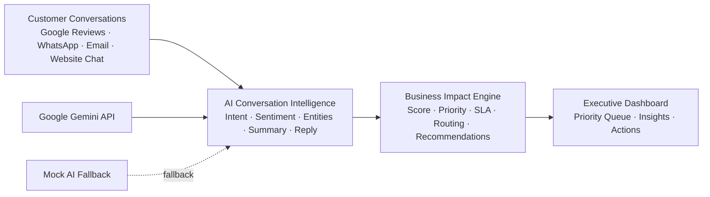
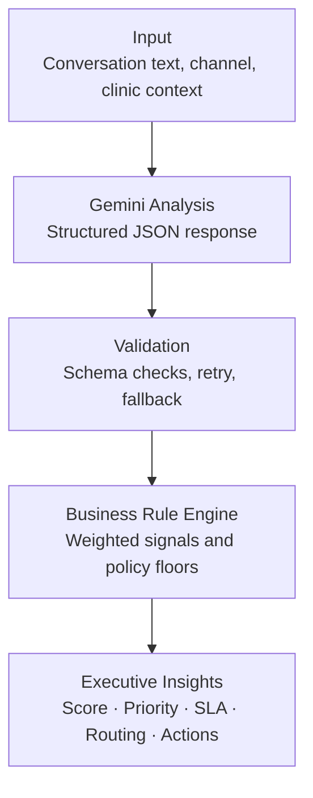

# Telosa Insight

**AI-Powered Executive Conversation Intelligence Platform for Multi-location Healthcare Brands**

[](https://nextjs.org/)
[](https://www.typescriptlang.org/)
[](https://ai.google.dev/)
[](https://tailwindcss.com/)
[](LICENSE)

Telosa Insight helps executive teams identify high-impact customer conversations instead of manually reviewing every message. It was built as a product design and engineering solution for the Apollo Dental scenario—a healthcare brand with **250+ clinics** receiving hundreds of conversations every day across Google Reviews, WhatsApp, email, and website chat.

> [!IMPORTANT]
> Telosa Insight is **not** an AI chatbot.  
> It is an **Executive Decision Support System** that combines Gemini-powered conversation understanding with a deterministic Business Impact Engine.

---

## Overview

### The business problem

Multi-location healthcare brands receive a continuous stream of:

- Appointment requests
- Treatment enquiries
- Billing and insurance questions
- Refund requests
- Clinical follow-up concerns
- Complaints and public reviews
- Positive feedback

Today, clinic managers and CX teams often review these conversations manually. The hard problem is not simply responding—it is knowing **which conversations deserve immediate executive attention**.

As conversation volume grows, critical issues get buried among routine requests. That creates delayed escalations, missed revenue opportunities, reputation risk, and inconsistent triage.

### Why traditional dashboards fail

Most dashboards are lagging indicators. They report volume, channel mix, and response times after the fact. They do not answer:

> Which conversation carries the greatest clinical urgency, revenue exposure, reputation risk, and escalation risk right now?

Volume metrics alone do not create prioritization. Executives still need a human to read every message and decide what matters.

### The need for Business Impact Intelligence

Telosa Insight introduces a second decision layer after AI understanding:

1. **Understand** the conversation with Google Gemini (or a deterministic mock provider).
2. **Score** the conversation with transparent business rules.
3. **Prioritize** with a reproducible Business Impact Score, priority, SLA, and routing recommendation.
4. **Present** the outcome in an executive-first dashboard.

The result is a focused operating view that helps leaders answer one question quickly:

> **What deserves my attention right now?**

---

## Technology stack

| Layer | Technologies |
| --- | --- |
| Frontend | Next.js 15, React 19, TypeScript, Tailwind CSS v4, shadcn/ui, Framer Motion, Recharts |
| Architecture | Service-layer architecture, Business Rules Engine, modular components, AI service abstraction |
| AI | Google Gemini API, deterministic mock fallback, explainable analysis workflow |

---

## Features

### AI features

- Server-side conversation analysis through Google Gemini
- Structured **intent** and **sentiment** classification
- Entity extraction for clinically and operationally relevant terms
- Concise AI **summary** and **suggested reply**
- Confidence scoring with provider visibility (`gemini`, `mock`, or `fallback`)
- Duplicate and spam signals in the analysis workflow
- Automatic mock fallback when Gemini is disabled or unavailable
- Structured JSON validation, retries, timeouts, and safe server-side error handling

### Business features

- Business Impact Score from **0–100**
- Priority classification: Critical, High, Medium, Low
- Priority-based response SLAs
- Team routing recommendations
- Executive recommended actions
- Transparent scoring breakdown across urgency, revenue impact, reputation risk, and escalation risk
- Policy floors for high-risk clinical, reputation, and refund scenarios

### Dashboard features

- Executive KPI cards with trends and sparklines
- Dynamic executive summary
- Ranked priority conversation queue
- Channel distribution and operational analytics
- AI insight cards and recommended actions
- Compact search, filtering, and sorting workspace
- Conversation detail and Business Impact explainability views
- Responsive dark enterprise interface for desktop, laptop, tablet, and mobile

### Technical features

- Next.js App Router with clear server/client boundaries
- Type-safe domain models and service contracts
- Independent AI, conversation, dashboard, and business services
- Reusable shadcn/ui component system
- Framer Motion micro-interactions
- Recharts visualizations
- ESLint, Prettier, TypeScript, and production build validation

---

## Architecture



### Layer responsibilities

| Layer | Responsibility |
| --- | --- |
| **Customer Conversations** | Normalized conversation records containing message text, channel, clinic, patient context, status, and timeline data |
| **AI Conversation Intelligence** | Server-only AI service that selects Gemini or mock analysis and returns validated structured output |
| **Business Impact Engine** | Deterministic rules that convert conversation and AI signals into score, priority, SLA, owner, and actions. This layer never calls an LLM |
| **Executive Dashboard** | Product surface that presents priorities, explanations, and recommended next actions |

---

## AI workflow



### What happens end to end

1. A conversation is selected for analysis.
2. The AI service sends a structured request to Gemini when `USE_REAL_AI=true`.
3. Gemini returns intent, sentiment, entities, summary, suggested reply, and confidence.
4. The response is validated. Transient failures retry once; genuine failures fall back to mock analysis.
5. The Business Impact Engine scores the conversation using deterministic weights and policy floors.
6. The UI surfaces the resulting score, priority, SLA, routing recommendation, and executive actions.

> [!NOTE]
> Gemini requests run **server-side only**. The API key and prompts are never exposed to the browser.

---

## Screens

### Executive Dashboard


### Conversation List


### Conversation Details


### Business Impact


> [!TIP]
> Place production screenshots at the `images/` paths above before publishing the repository.

---

## Project structure

```text
.
├── app/
│   ├── business-impact/[id]/
│   ├── conversation/
│   │   ├── [id]/
│   │   ├── actions.ts
│   │   └── page.tsx
│   ├── dashboard-actions.ts
│   ├── globals.css
│   ├── layout.tsx
│   └── page.tsx
├── components/
│   ├── business-impact/
│   ├── conversation/
│   ├── dashboard/
│   ├── layout/
│   ├── shared/
│   └── ui/
├── services/
│   ├── ai/
│   ├── business/
│   ├── config/
│   ├── conversation/
│   ├── dashboard/
│   └── index.ts
├── lib/
│   ├── design-tokens.ts
│   ├── formatters.ts
│   ├── status-styles.ts
│   └── utils.ts
├── mock/
│   ├── clinics.ts
│   ├── conversations.ts
│   ├── patients.ts
│   └── index.ts
├── docs/
│   ├── FeatureSpecification.md
│   ├── ImplementationPlan.md
│   ├── MockData.md
│   ├── ProblemStatement.md
│   ├── SystemArchitecture.md
│   └── UIUXSpecification.md
├── types/
│   ├── domain.ts
│   ├── index.ts
│   └── ui.ts
├── .env.example
├── LICENSE
├── package.json
└── README.md
```

### Directory responsibilities

| Directory | Purpose |
| --- | --- |
| `app/` | Next.js App Router pages, layouts, loading/error boundaries, and server actions |
| `components/` | Feature UI, application shell, shared product components, and shadcn/ui primitives |
| `services/` | AI provider abstraction, conversation orchestration, dashboard aggregation, configuration, and deterministic business scoring |
| `lib/` | Design tokens, status styles, formatting helpers, and shared utilities |
| `mock/` | Realistic clinic, patient, and conversation fixtures used by the demo and fallback workflow |
| `docs/` | Product strategy, architecture, UX, feature, data, and implementation specifications |
| `types/` | Shared domain and UI TypeScript definitions |

---

## Installation

### Prerequisites

- Node.js 20+
- npm

### Local development

```bash
git clone <repository-url>
cd "Telosa Insight"
npm install
cp .env.example .env.local
npm run dev
```

Open [http://localhost:3000](http://localhost:3000).

### Production build

```bash
npm run build
npm run start
```

### Quality checks

```bash
npm run lint
npm run format:check
```

---

## Environment variables

| Variable | Required | Default | Description |
| --- | --- | --- | --- |
| `GEMINI_API_KEY` | When live AI is enabled | — | Server-side Google Gemini API key. Never expose it with a `NEXT_PUBLIC_` prefix. |
| `USE_REAL_AI` | No | `false` | Set to `true` to use Gemini as the primary provider. When `false`, deterministic mock analysis is used. |
| `GEMINI_MODEL` | No | `gemini-3.6-flash` | Gemini model used by the server-side REST provider. |

Example `.env.local`:

```bash
USE_REAL_AI=true
GEMINI_API_KEY=your_api_key
GEMINI_MODEL=gemini-3.6-flash
```

> [!CAUTION]
> Keep `.env.local` out of source control. Never commit a real Gemini API key.

---

## Business Impact Engine

The Business Impact Engine is intentionally separated from LLM reasoning.

Gemini describes the conversation. Deterministic business policy decides how the organization should prioritize it.

### Inputs

- Raw conversation text
- Conversation channel
- Structured AI analysis
- Patient context, including high-value status where available
- Current conversation status

### Scoring logic

Four explainable signals are scored on a 0–100 scale and combined with fixed weights:

| Signal | Weight | Evidence examples |
| --- | ---: | --- |
| Urgency | 30% | Emergency intent, pain, swelling, fever, worsening symptoms, delayed callbacks |
| Revenue impact | 25% | High-value treatments, refund exposure, treatment enquiries, high-value patients |
| Reputation risk | 25% | Public-review channel, complaints, strongly negative sentiment, reputational language |
| Escalation risk | 20% | Duplicate contact, repeated follow-up, escalation language, escalated status |

Transparent policy floors can raise the final score for urgent clinical concerns, high-risk public reviews, high-value patient exposure, and material refund requests.

### Priority calculation

| Score | Priority | SLA |
| ---: | --- | --- |
| 80–100 | Critical | 1 hour |
| 65–79 | High | 3 hours |
| 40–64 | Medium | 8 hours |
| 0–39 | Low | 24 hours |

### Routing

Intent, priority, and channel determine the recommended owner—for example On-call Dentist, Clinic Manager, Finance, Billing, Treatment Coordinator, Front Desk, CX Head, or CX Team.

### Executive recommendations

The engine produces concrete next actions and human-readable reasoning for the final score. This keeps the workflow:

- **Explainable** — Every score has visible contributing signals
- **Reproducible** — Identical inputs produce identical business outcomes
- **Configurable** — Weights, thresholds, and SLAs live in dedicated scoring configuration
- **Safe** — Business policy is not delegated to non-deterministic model reasoning

---

## Design principles

- **AI should assist, not replace, human decision-making.**
- **Recommendations must be explainable.**
- **The experience is executive-first.**
- **Information hierarchy should reveal risk before detail.**
- **Human review remains part of the workflow.**
- **Clinical and operational language should remain conservative and action-oriented.**

---

## Documentation

Product and engineering specifications live in [`docs/`](docs/):

| Document | Description |
| --- | --- |
| [`ProblemStatement.md`](docs/ProblemStatement.md) | Business context, user problem, goals, and MVP boundaries |
| [`SystemArchitecture.md`](docs/SystemArchitecture.md) | System architecture, technical stack, module boundaries, and extensibility strategy |
| [`UIUXSpecification.md`](docs/UIUXSpecification.md) | Enterprise design principles, interaction patterns, accessibility, and responsive behavior |
| [`FeatureSpecification.md`](docs/FeatureSpecification.md) | Functional behavior and acceptance criteria for dashboard, conversation analysis, and Business Impact |
| [`MockData.md`](docs/MockData.md) | Realistic fixture definitions, channel distribution, and demo scenarios |
| [`ImplementationPlan.md`](docs/ImplementationPlan.md) | Phased engineering plan and implementation standards |

> [!NOTE]
> Several documents capture the original mock-first MVP plan. The current implementation extends that foundation with an optional live Gemini provider while retaining deterministic fallback behavior.

---

## Future enhancements

The following are product opportunities, not features included in the current build:

- Multi-channel integrations for WhatsApp, email, review platforms, and CRM systems
- Real-time conversation ingestion and streaming updates
- Agentic triage and follow-up workflows with approval gates
- Predictive escalation and churn analytics
- Role-based dashboards and permissions
- Immutable audit logs for AI and business decisions
- Cross-clinic trend and anomaly detection
- Historical benchmarking and configurable executive alerts

---

## License

This project is available under the [MIT License](LICENSE).

---

Telosa Insight demonstrates how AI engineering, product thinking, explainable business rules, and executive UX can work together to solve a real enterprise customer-experience challenge. Rather than adding another conversational interface, it turns unstructured customer feedback into clear, defensible decisions for the people responsible for acting on it.
