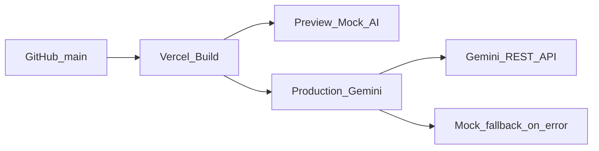

# Vercel Deployment Guide

Deploy Telosa Insight (Next.js 15 App Router) to Vercel from the GitHub repository. Preview deployments use deterministic mock AI; Production uses live Gemini with mock fallback on failure.

## Prerequisites

- GitHub repository access: [Rukhsar24081998/Telosa-Insight-AI-](https://github.com/Rukhsar24081998/Telosa-Insight-AI-)
- A [Vercel](https://vercel.com) account with permission to import the repo
- Local verification complete:
  - `npm run build && npm run start`
  - `npm run lint`
- A Gemini API key from [Google AI Studio](https://aistudio.google.com/) for Production (not required for Preview)
- Confirm `.env.local` and real secrets are **not** committed

## Architecture on Vercel

| Item | Value |
| --- | --- |
| Framework | Next.js 15 (auto-detected) |
| Root directory | `.` (repository root) |
| Install command | `npm install` |
| Build command | `npm run build` (`next build --turbopack`) |
| Start / runtime | Vercel Next.js runtime (no Docker) |
| Data | In-repo mock fixtures; no database |
| Secrets | Server-only Gemini env vars (never `NEXT_PUBLIC_`) |



## Import the project

1. Open [Vercel Dashboard](https://vercel.com/dashboard) → **Add New…** → **Project**.
2. Import `Rukhsar24081998/Telosa-Insight-AI-`.
3. Leave framework settings at defaults:
   - **Framework Preset:** Next.js
   - **Root Directory:** `.`
   - **Build Command:** `npm run build`
   - **Output Directory:** leave empty (Next.js default; do not use static export)
   - **Install Command:** `npm install`
4. Use the Vercel default Node.js version (18+ / 20+). Next.js 15.5 is compatible.
5. Configure environment variables (next section) before the first Production deploy, or add them and redeploy afterward.
6. Click **Deploy**.

No `vercel.json` is required for the default setup.

## Environment variables

Configure in **Project → Settings → Environment Variables**.

| Variable | Preview | Production | Description |
| --- | --- | --- | --- |
| `USE_REAL_AI` | `false` | `true` | When `false`, `AIService` uses deterministic mock analysis. When `true`, Gemini is primary and mock is the failure fallback. |
| `GEMINI_API_KEY` | unset | set (secret) | Server-side Google Gemini API key. Never use a `NEXT_PUBLIC_` prefix. |
| `GEMINI_MODEL` | unset (defaults in code) | `gemini-3.6-flash` | Model id for the Gemini REST provider. |

Recommended Production values:

```bash
USE_REAL_AI=true
GEMINI_API_KEY=<your_secret_key>
GEMINI_MODEL=gemini-3.6-flash
```

Recommended Preview values:

```bash
USE_REAL_AI=false
```

After changing Production secrets, trigger a **Redeploy** so the new environment is applied.

> [!CAUTION]
> Keep API keys out of git, README examples with real values, and client bundles. They are read only on the server via `services/config/env.ts`.

## Deploy flow

| Trigger | Environment | AI mode |
| --- | --- | --- |
| Push to `main` | Production | Live Gemini (`USE_REAL_AI=true`) |
| Pull request / other branches | Preview | Mock AI (`USE_REAL_AI=false`) |

## Smoke tests

After a Production deploy, open the deployment URL and verify:

1. **`/`** — Dashboard KPIs, executive summary, channel chart, AI insights.
2. **`/conversation`** — Conversation list, search, and filters render.
3. **`/conversation/CONV-009`** — Detail view loads; use **Analyze with AI** and confirm live Gemini (no mock-only banner when Production env is correct).
4. **`/business-impact/CONV-009`** — Business Impact Score, explainability breakdown, and recommended actions.

Preview deployments should show mock AI behavior and may display the mock-provider notice in the conversation AI panel.

## Rollback

1. Open the Vercel project → **Deployments**.
2. Select the last known-good Production deployment.
3. Choose **⋯ → Redeploy** (or promote that deployment to Production, depending on the Vercel UI).
4. Re-run the smoke tests above.

If a bad deploy was caused by env misconfiguration, fix the variables first, then redeploy.

## Troubleshooting

### Build fails on Vercel

- Confirm the install and build logs show `npm install` and `npm run build`.
- Reproduce locally with `npm ci` (or `npm install`) then `npm run build`.
- If Turbopack production build fails in CI, temporarily set the Vercel Build Command override to `next build` (without `--turbopack`) and retest. Prefer keeping `npm run build` once fixed.

### Gemini not used on Production

- Confirm `USE_REAL_AI=true` is set for the **Production** environment (not only Preview/Development).
- Confirm `GEMINI_API_KEY` is set for Production and the deployment was created **after** the variable was saved.
- Redeploy Production after any env change.
- Check server logs for Gemini errors; `AIService` falls back to mock on failure.

### Model or API errors (404 / auth)

- Verify `GEMINI_MODEL` matches a model available to your key (default: `gemini-3.6-flash`).
- Regenerate the API key in Google AI Studio if auth fails.
- Ensure the key is not truncated or wrapped in quotes incorrectly in the Vercel UI.

### Mock banner still visible on Production

- The conversation AI panel shows a mock notice when the mock provider is active.
- Double-check Production env, redeploy, hard-refresh the browser, and confirm you are on the Production URL (not a Preview URL).

### Runtime / Server Action errors

- Server Actions live in `app/conversation/actions.ts` and `app/dashboard-actions.ts` and run on the Vercel Node runtime.
- No edge runtime override is required for the default deploy.

## Optional hardening

These are out of scope for the baseline deploy but can be added later in the Vercel UI:

- Custom domain and HTTPS
- Deployment Protection / password for Production
- Region selection if Gemini latency is a concern
- Branch alias rules for staging
